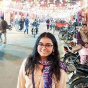
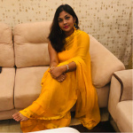

# Association for Women in Computing Machinery
### **Empowering and upskilling women in professional domains** 

[Official Website for ACM-W NITK](https://acm-w-nitk.github.io/)

### Contact Us:  
[acmw.nitk@gmail.com](mailto:acmw.nitk@gmail.com?subject=[GitHub]ACMW)  
[https://www.facebook.com/acmwnitk/](https://www.facebook.com/acmwnitk/)  
[https://www.linkedin.com/company/acm-w-nitk/](https://www.linkedin.com/company/acm-w-nitk/)
[https://www.instagram.com/acmw_nitk/](https://www.instagram.com/acmw_nitk/)

---
## About:
ACM-W is an international organisation which supports and empowers women in all aspects of the computing field. We at ACM-W, NITK chapter wish to inspire and nurture young minds to step up and make a mark in the computing universe. Our aim is to promote learning and create a workspace where the ideas of young women can take shape and build the future.From providing a wide range of opportunities, to working in a larger community to advance contributions by creative minds, ACM-W NITK aims to be a stepping stone for women to be celebrated and create a difference. 

## **M K Apoorva** (Chair)
  
[https://www.facebook.com/apoorva.m.krishnamurthy](https://www.facebook.com/apoorva.m.krishnamurthy)  
[https://www.linkedin.com/in/apoorva-m-k-b23406169/](https://www.linkedin.com/in/apoorva-m-k-b23406169/)

## **Archita Sajjan** (Vice-Chair)
  
[https://en-gb.facebook.com/people/Archita-Sajjan/100019373504599](https://en-gb.facebook.com/people/Archita-Sajjan/100019373504599)  
[https://www.linkedin.com/in/archita-sajjan-a44410160/](https://www.linkedin.com/in/archita-sajjan-a44410160/)
